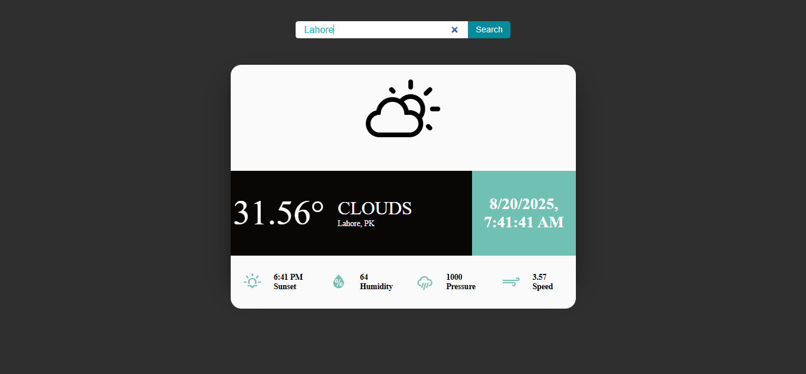

# Weather App

A simple React weather application that displays current weather information for any city using the OpenWeatherMap API.



## Features

- Search for weather by city name
- Displays temperature, humidity, pressure, wind speed, and sunset time
- Responsive and modern UI
- Weather icons for different conditions

## Demo


## Getting Started

### Prerequisites

- Node.js (v16 or higher recommended)
- npm

### Installation

1. Clone the repository:
   ```sh
   git clone https://github.com/your-username/weather-app.git
   cd weather-app
   npm install
   npm run dev